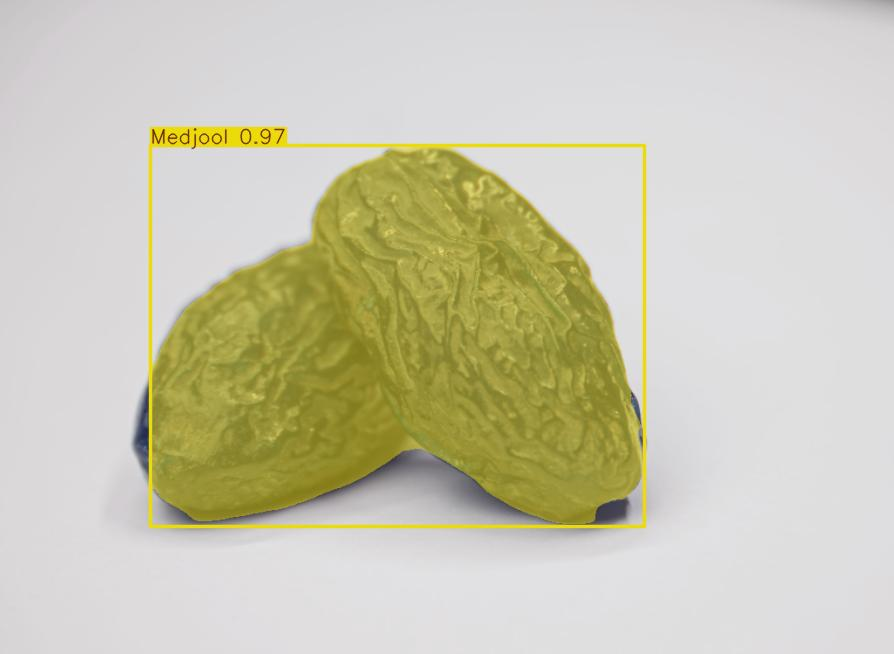
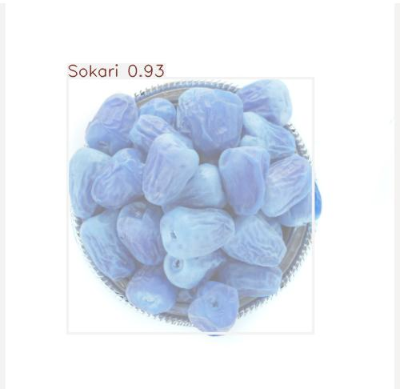

#  Saudi Date Classifier (YOLOv8 + FastAPI + Streamlit + Docker + AWS)

A lightweight and fully containerized **YOLOv8 segmentation-based classifier** to detect and classify Saudi date types using AI.

---

##  Example Predictions

<p align="center">
  
  
</p>

<p align="center">
  <i>Examples of YOLOv8 Segmentation Output – Sokari & Medjool</i>
</p>

---

##  Tech Stack
-  **YOLOv8-X Segmentation** – High-accuracy image segmentation  
-  **FastAPI** – Backend API for model prediction  
-  **Streamlit** – Interactive frontend UI  
-  **Docker** + **Docker Compose** – Easy containerization & service orchestration  
-  **AWS EC2** – Cloud deployment and testing  

---

##  Project Goal
My goal was to learn and experiment with:
- Deploying real segmentation models using **AWS EC2 + Docker**
- Building full-stack AI apps (backend + frontend)
- Using Docker Compose to coordinate services
- Validating deployment on cloud environments (AWS)

---

##  Deployment

This project was successfully deployed and tested on an **AWS EC2 instance** using Docker Compose.  
Although the instance was temporary (~30 mins ), it confirmed the project’s cloud readiness and real-world functionality.

>  FastAPI and Streamlit both worked smoothly over the public IP.

---

##  Limitations
To get the best predictions:
-  Upload **only one date fruit per image**
-  Use a **clean and plain background** (preferably white)
-  Avoid distractions (cups, hands, etc.)
-  Ensure good lighting

---

##  Supported Classes
- `Sokari`  
- `Sugaey`  
- `Ajwa`  
- `Medjool`  

---

##  Model File

 Download the trained model and place it in the root as:  
`date_fruit_model.pt`

[ Download from Google Drive](https://drive.google.com/file/d/1-tHzIK7pQUkJzNjdVsTYUydDsf7DIXoW/view?usp=sharing)

---

##  Running the Project (Docker)

```bash
# 1. Clone the repo
git clone https://github.com/DH99MJ/saudi-date-classifier.git
cd saudi-date-classifier

# 2. Build & run using Docker Compose
docker compose up --build

# 3. Run <3
•	 Frontend: http://localhost:8501
•	 Backend: http://localhost:8000/docs
# saudi-dates-multimodel
